# gVDS (Golang Virtual Dedicate Server)
맞고, 바둑, FPS 게임 같이 방 개념을 가지고 있는 게임 서버를 MO 게임 서버라고 말 할 수 있다.
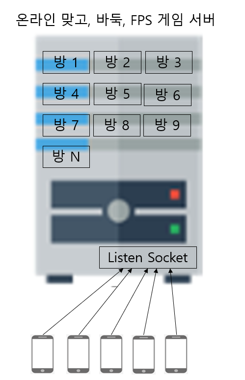   	
  
해외의 경우 MO류 게임(특히 액션)은 대부분 데디케이트 서버로 만들지만, 한국은 방 개념으로 하나의 서버에서 많은 동시 접속자 수를 처리하는 서버로 만들다. 그리고 요즘은 액션성이 강한 게임은 데디케이트 서버로 만들기도 한다.    
  
데디케이트 서버는 주로 1개의 게임만 돌아가는 구조로 만들어진 게임 서버라서 동시 접속자 수가 작다. 그래서 게임 컨텐츠를 이외의 순수 서버 기능만을 봤을 때는 구현이 싶다. 
  
gVDS의 MO 게임서버를 만들 때 데디케이트 게임 서버의 간단함과 Go의 고루틴을 장점을 살린 서버 아키텍처이다.  
1개의 방이 1개의 게임서버이고, 이것을 호스팅하는 레이어에서 고루틴으로 복수의 방을 실행하는 구조이다.  
게임 서버를 만들 때 작은 수의 동시접속자 수를 가정해서, 간단하게 구현할 수 있다.  
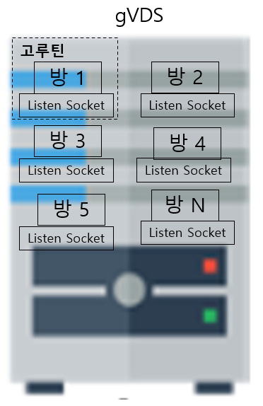   	
  
  
## 특징
- Golang의 고루틴을 활용한다.
- 스케일 업, 스케일 아웃에 잘 대응한다.
- 특정 부분에 장해가 발생해도 다른 부분에는 장해를 발생시키지 않는다.
- MO 계열 서버의 방을 1개의 데디케이트 서버로 만든다
- 서버는 사용하는 방만큼 데디케이트 서버 인스턴스가 만들어지고, 각 데디는 자신만의 네트워크를 사용한다(즉 개별로 listen 포트를 가진다
    - 데디케이트 서버는 smallNet 라이브러리를 사용한다
    - smallNet은 최대 100명 이하의 동시 접속자 처리만을 가정한다
- 호스팅 서버(실제 서버 애플리케이션으로 동작하는)는 복수의 서로 다른 데디 서버 군을 사용할 수 있다.
- DB 등의 비동기I/O 작업은 각 데디에서 외부에 요청한다  
   
     
     
  

## SmallNet 특징
- Send 고루틴은 세션별로 만들지 않고 서버 인스턴스 바로 보낸다.  
    - Send는 1개의 고루틴에서만 호출할 수 있다.
	- 그래서 특정 세션에서 병목이 되지 않도록 허트비트를 꼭 하고, 허트비트가 오지 않으면 보내지 않는다.
    - 허트비트는 만약을 대비해서 서버에서 랜던 값을 보내면, 클라는 이것을 그대로 돌려 보낸다
- SmallNet은 1개의 고루틴에서 사용되는 것을 가정한다. 즉 패킷처리는 1개의 고루틴에서만 한다.
- 네트워크로 받기/보내기 에서 매번 메모리 할당을 하지 않고, 링버퍼를 사용한다. 그리고 zeor copy로 동작한다.
    
  
     
    
  
## 샘플 코드: 에코 서버
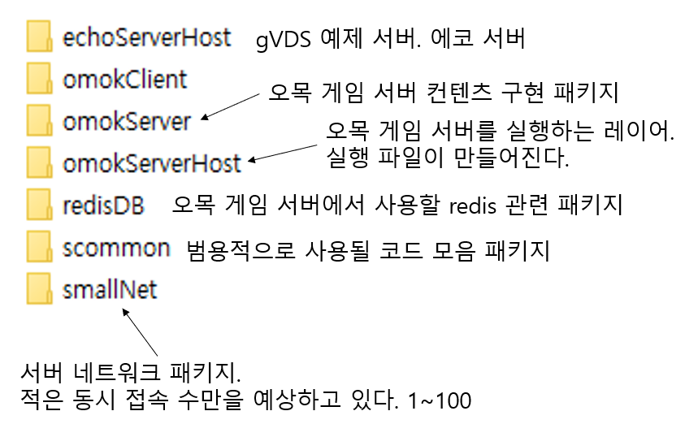   	
  
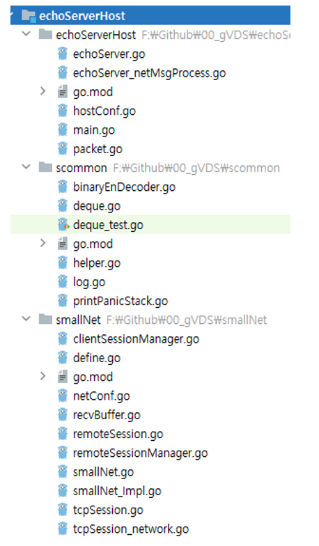   	
  
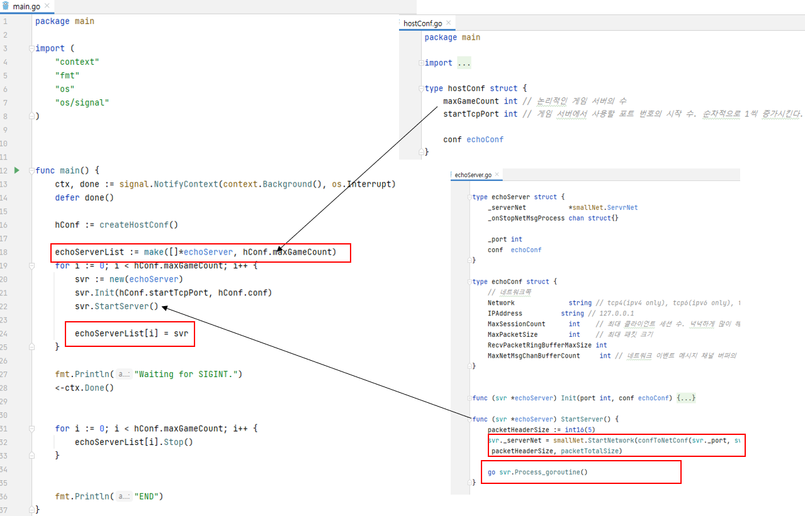   	
  
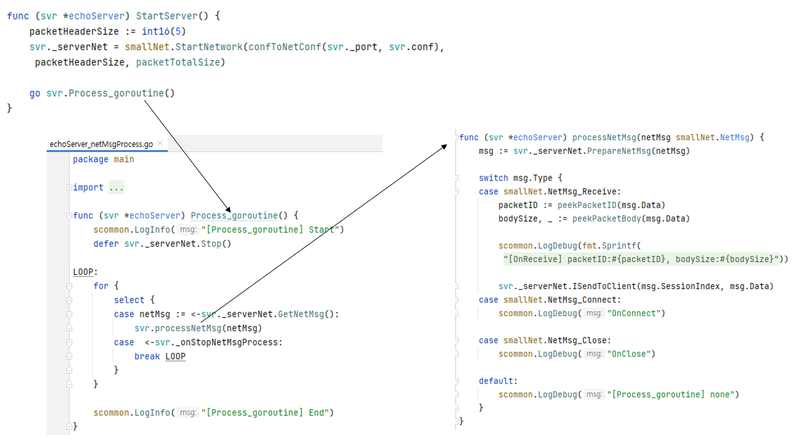   	 
  

  
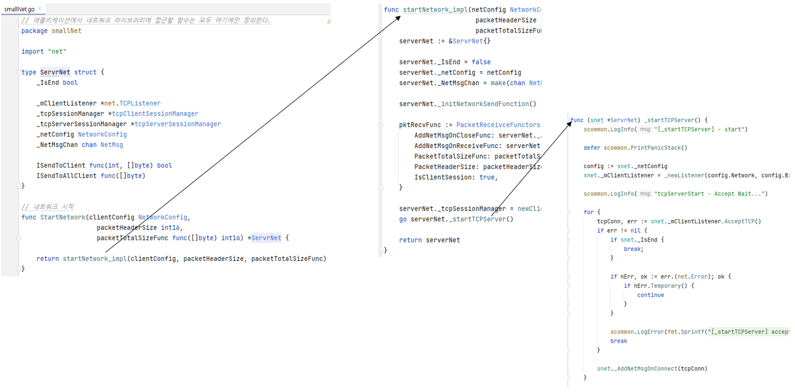   	

   
  

## 샘플 코드: 오목 게임 서버    
  
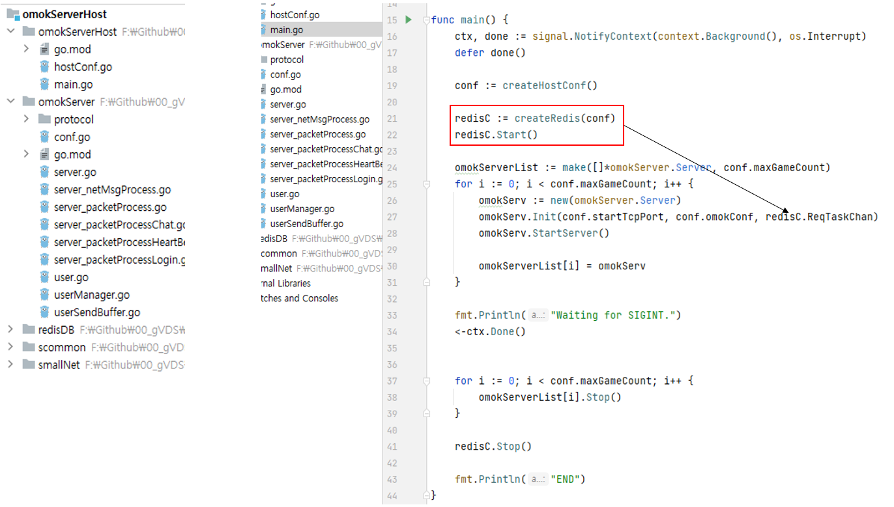   	
  
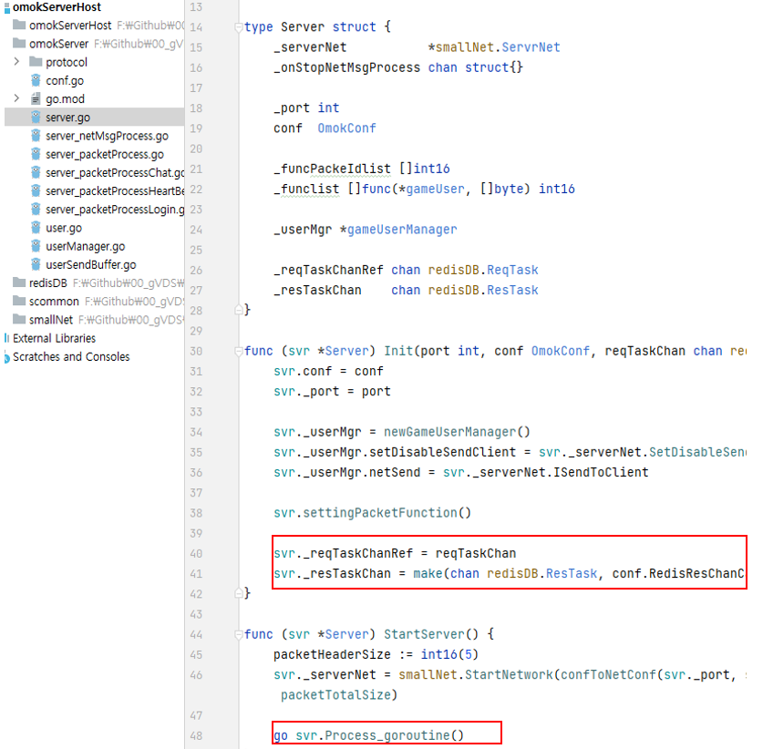   	
  
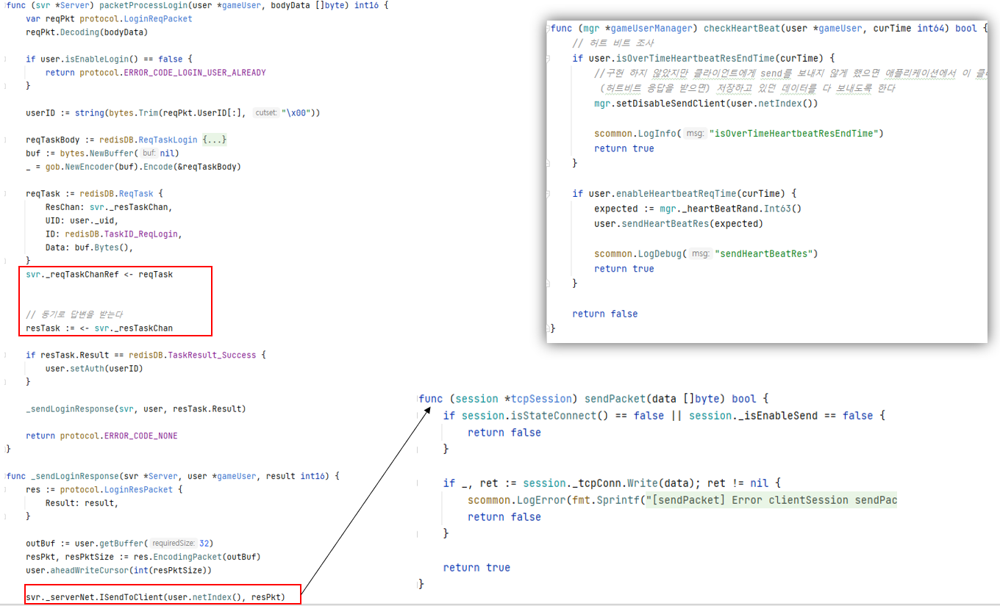   	 
  
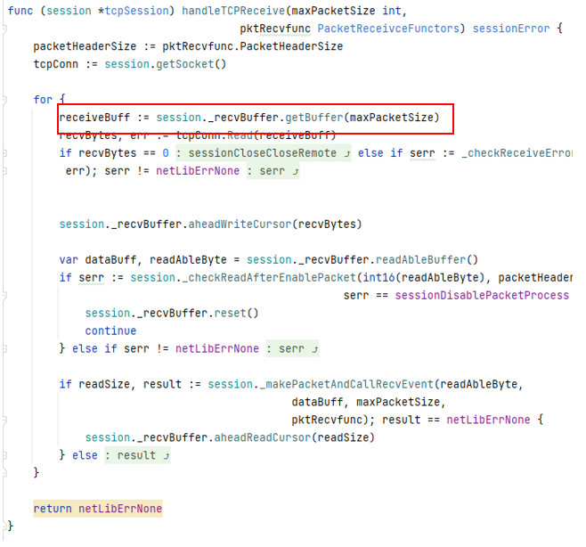   	
 
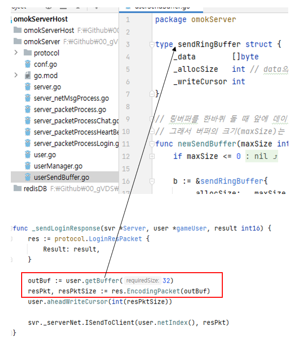   	
  
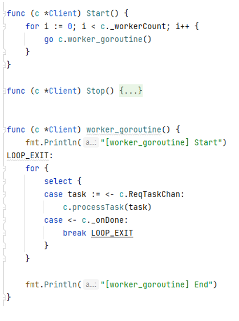   	 
  
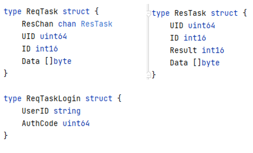   	
  
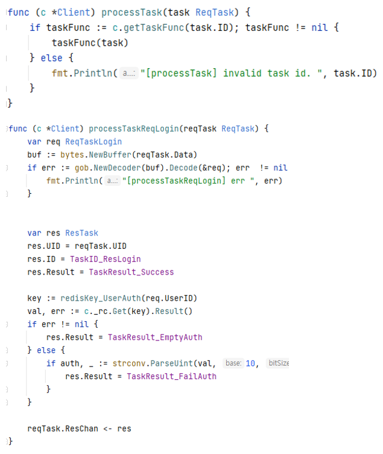   	
  